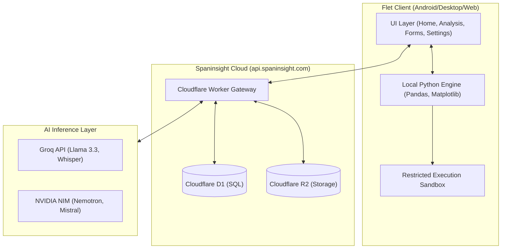

<p align="center">
  
</p>

<h1 align="center">Spaninsight</h1>

<p align="center">
  <b>High-Performance Privacy-First Data Intelligence Platform</b>
</p>

<p align="center">
  Professional data analysis, AI-powered survey generation, and automated reporting.
  <br />
  Your data stays on your device — local execution, global intelligence.
</p>

<p align="center">
  
  
  
  
</p>

---

## Core Capabilities

| Capability | Description |
|:---|:---|
| **Automated Analysis** | Intelligent data ingestion (CSV/Excel) with AI-suggested insights and local code execution. |
| **Smart Surveys** | Natural language survey generation (Text/Voice) with automated D1 schema deployment. |
| **Autopilot Engine** | Multi-pass analysis orchestration for comprehensive automated report generation. |
| **Enterprise Export** | Professional rendering of reports to PDF and PowerPoint formats with R2 cloud sharing. |
| **Local Security** | Sandbox-restricted Python execution environment ensuring 100% data residency. |

---

## Architecture



---

## Project Structure

```text
spaninsight/
├── gateway/
│   ├── index.js          # Cloudflare Worker (AI + D1 + R2)
│   └── schema.sql        # D1 database schema
├── src/
│   ├── main.py            # App entry point
│   ├── core/              # Global state, constants, and themes
│   ├── components/        # Reusable UI widgets
│   ├── services/          # Business logic (AI, Audio, Sandbox, DB)
│   └── views/             # Functional application screens
└── requirements.txt       # Production dependencies
```

---

## Getting Started

### Prerequisites
- Python 3.13+
- [uv](https://github.com/astral-sh/uv) (recommended)

### Installation
```bash
git clone https://github.com/Nwokike/spaninsight.git
cd spaninsight
uv venv
uv pip install -r requirements.txt
```

### Execution
```bash
flet run
```

---

## Infrastructure Configuration

The application requires the following Cloudflare Worker bindings for production functionality:

| Binding | Type | Required For |
|:---|:---|:---|
| `GROQ_API_KEYS` | Secret | Primary Inference (Llama/Whisper) |
| `NVIDIA_API_KEYS` | Secret | Fallback Reasoning & Vision |
| `DB` | D1 Database | Survey Management & Response Storage |
| `REPORTS` | R2 Bucket | Public Report Sharing & Persistence |

---

## Intelligence Fallback System

The Spaninsight Gateway implements a robust multi-model fallback strategy to ensure high availability:

1. **Tier 1 (Groq)**: Ultra-low latency inference for code generation and transcription.
2. **Tier 2 (NVIDIA NIM)**: High-fidelity reasoning for complex data interpretation and vision tasks.
3. **Tier 3 (Circuit Breaker)**: Graceful degradation and user-side notification on network/API failure.

---

## Compliance & Security

- **Data Residency**: No raw data files are transmitted to the cloud. Only metadata headers are used for AI context.
- **Execution Sandbox**: Strict AST-based filtering prevents unauthorized system calls within the local environment.
- **Authentication**: Stateless HMAC-based secret validation for all gateway communication.

---

## License

This project is proprietary software. All rights reserved.

---

<p align="center">
  <em>Developed by Spaninsight Engineering</em>
</p>
