

  

  A high-performance, privacy-first data intelligence platform for smart data collection, analysis and reporting

  
  
   
  

---

## Download

| Platform | Download | Notes |
|:--------:|:--------:|:------|
| 🪟 **Windows** | [**SpanInsight_Setup.exe**](https://github.com/Nwokike/spaninsight/releases/latest/download/SpanInsight_Setup.exe) | Windows 10/11 64-bit Installer |
| 🤖 **Android** |  | Recommended for most users |

### Android (APK direct download)

| Variant | Download | Notes |
|:--------|:--------:|:-----|
| 📱 **ARM64** (most phones) | [**spaninsight-arm64-v8a.apk**](https://github.com/Nwokike/spaninsight/releases/latest/download/spaninsight-arm64-v8a.apk) | Modern 64-bit devices |
| 📱 **ARMv7** (older phones) | [**spaninsight-armeabi-v7a.apk**](https://github.com/Nwokike/spaninsight/releases/latest/download/spaninsight-armeabi-v7a.apk) | 32-bit ARM devices |
| 💻 **x86_64** (emulators) | [**spaninsight-x86_64.apk**](https://github.com/Nwokike/spaninsight/releases/latest/download/spaninsight-x86_64.apk) | Chromebooks & emulators |

---

## Core Capabilities

| Capability | Description |
|:---|:---|
| **Collaborative Workspace** | Multi-collaborator workspaces grouped under secure 6-digit PIN keys. Sync analyses, reports, and survey forms in real-time. |
| **Recipe Re-execution** | Data residency is guaranteed. Raw datasets remain local to each collaborator. Shared analysis steps are processed as recipes that re-execute inside local sandboxes. |
| **Smart Surveys** | Natural language survey generation (Text/Voice) with real-time preview — great for student research and customer feedback. |
| **Autopilot Engine** | Multi-pass analysis orchestration for comprehensive automated report generation. |
| **Professional Export** | Export reports as PDF and PowerPoint with secure cloud sharing via ephemeral links. |
| **Local Security** | Sandbox-restricted Python execution environment ensuring 100% data residency. |

---

## Screenshots

### Desktop Experience

  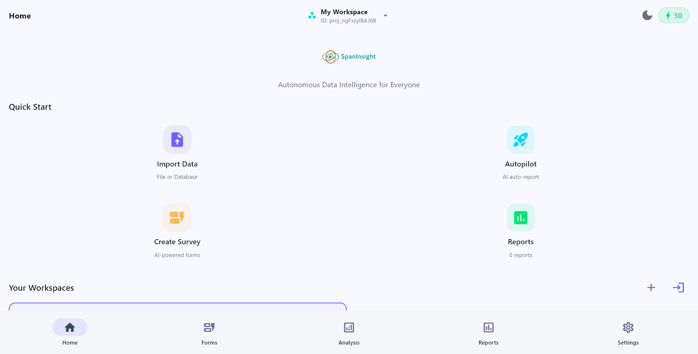

<em>Workspace Home Screen — seamlessly collaborate and organize project files</em>

  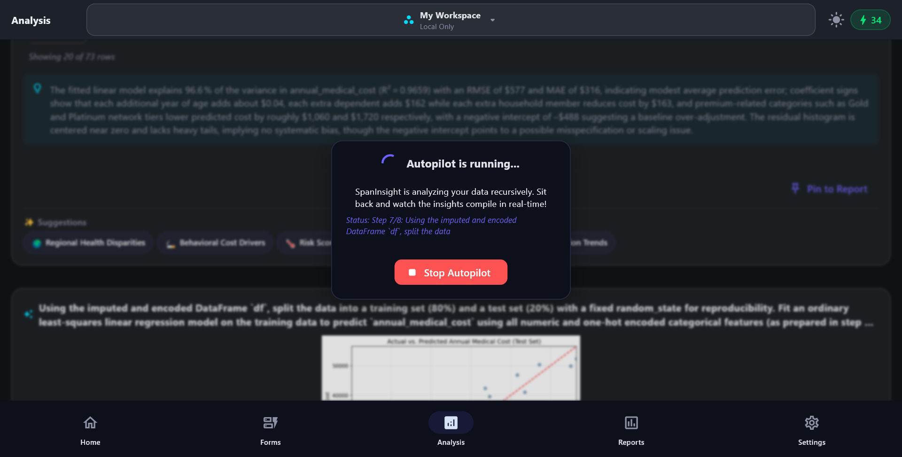

<em>Autonomous AI Autopilot — multi-pass local analysis orchestration for report generation</em>

### Mobile Experience

<table>
  <tr>
    <td width="50%">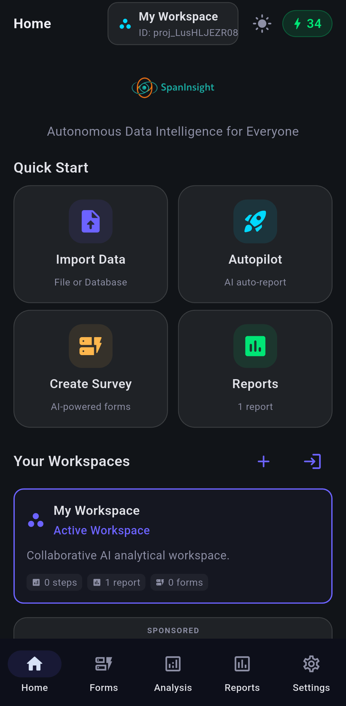</td>
    <td width="50%">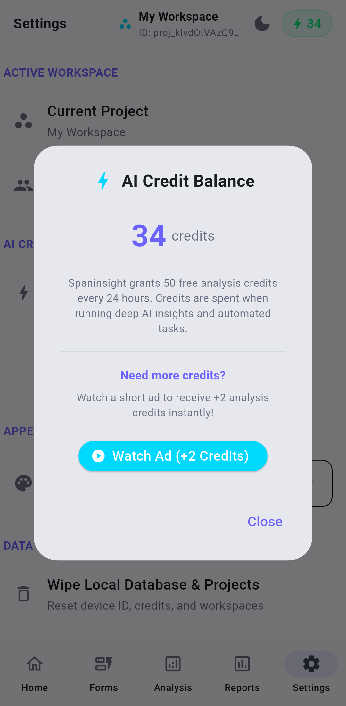</td>
  </tr>
  <tr>
    <td align="center"><em>Home Dashboard — dark theme optimized for local secure workspace sync</em></td>
    <td align="center"><em>AdMob & Rewards — watch buffered interstitial ads to top-up daily free credits</em></td>
  </tr>
</table>

<table>
  <tr>
    <td width="33%">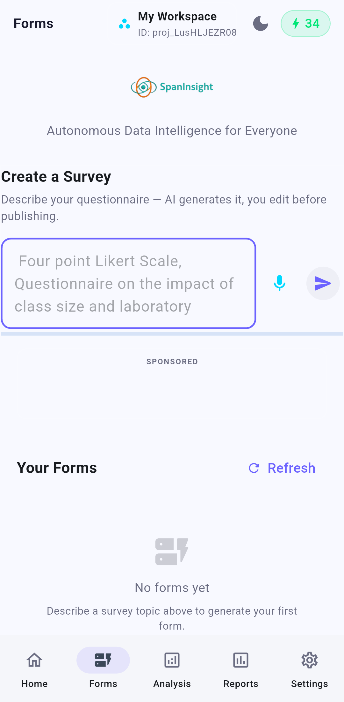</td>
    <td width="33%">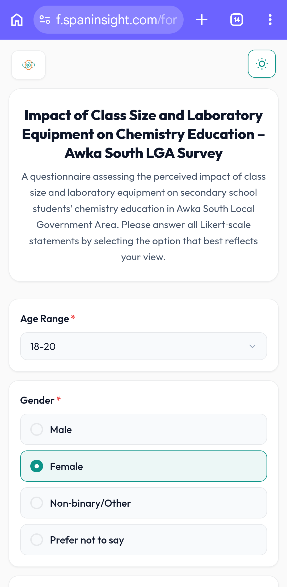</td>
    <td width="33%">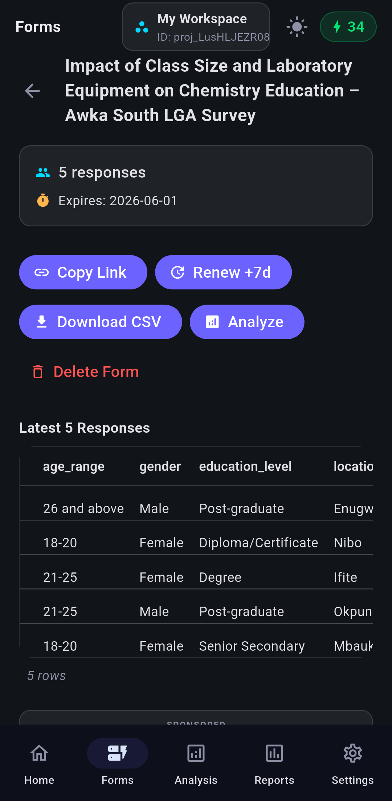</td>
  </tr>
  <tr>
    <td align="center"><em>Smart Survey Builder — generate forms from voice or text prompts</em></td>
    <td align="center"><em>Public Web Survey — responsive client interface for fast data collection</em></td>
    <td align="center"><em>Live Responses — track user feedback in real time with quick-actions</em></td>
  </tr>
</table>

<table>
  <tr>
    <td width="50%">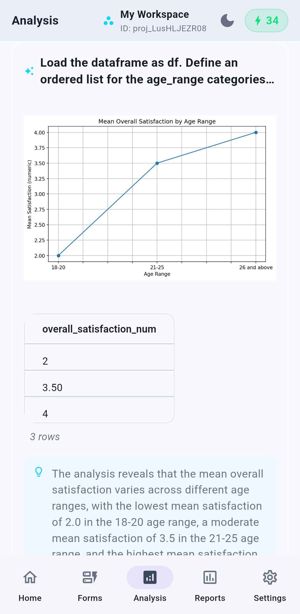</td>
    <td width="50%">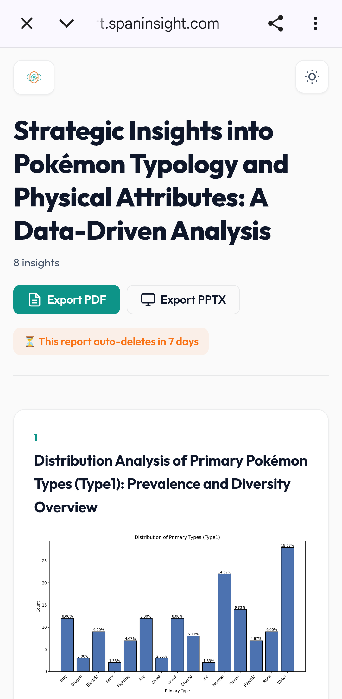</td>
  </tr>
  <tr>
    <td align="center"><em>Local Data Analysis — visual charts, tables, and sandboxed execution blocks</em></td>
    <td align="center"><em>Interactive Shared Reports — public-facing web insights hosted on report.spaninsight.com</em></td>
  </tr>
</table>

<table>
  <tr>
    <td width="50%">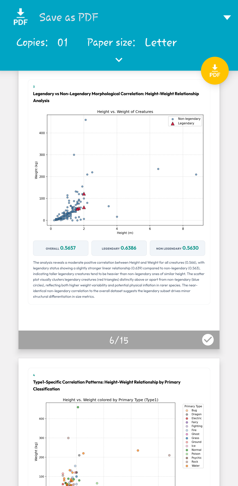</td>
    <td width="50%">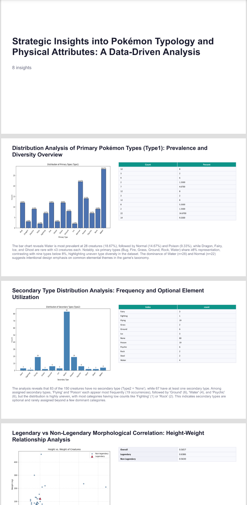</td>
  </tr>
  <tr>
    <td align="center"><em>Export to PDF — native layout engine with print preview controls</em></td>
    <td align="center"><em>PowerPoint Slide Generator — export report structures into PPT format</em></td>
  </tr>
</table>

---

## Features

- **Privacy-First AI** — Analysis runs locally; only AI prompts touch the secure gateway, never your raw dataset files.
- **Dynamic Workspaces** — Create, join, and switch between separate project workspaces instantly via a top-right switcher drop-down.
- **Voice-to-Insight** — Use natural language voice commands to query your data or build survey forms.
- **Editable Code Blocks** — View, edit, and re-run the Python code behind every analysis result.
- **Local Sandbox** — Built-in Python runtime (`pandas`, `matplotlib`) runs in a restricted environment.
- **Credit-Based System** — AI tasks use a transparent credit system with generous daily free allowances.
- **Native Desktop & Mobile** — High-performance, optimized deployments across Windows and Android devices.
- **Google AdMob Integration** — Safe, buffered banner and interstitial advertising support for mobile app users.
- **Resilient Mobile Sandbox** — Hardened client environment utilizing sandboxed directory access (`FLET_APP_STORAGE_DATA`/`TEMP`) for maximum permission security and zero PermissionError crashes.

---

## Architecture

| Layer | Technology | Purpose |
|:---|:---|:---|
| **Frontend** | Flet | Reactive UI with vibrant styling, dark mode, and smooth transitions |
| **Compute** | Local Python Runtime | Pandas-based data processing & Matplotlib rendering |
| **Secure Edge Gateway** | Secure Gateway (api.spaninsight.com) | Private multi-model AI orchestration with automatic failover |
| **Edge Metadata Store** | Secure Edge Database | Workspace configurations, collaborative forms, and response indices |
| **Ephemeral Cache Store** | Ephemeral Secure Storage | Fast-loading shared interactive reports (7-day lifecycle) |
| **Local Storage** | Platform Keychain | Encrypted client-side credentials & offline project states |

### Visual Flow

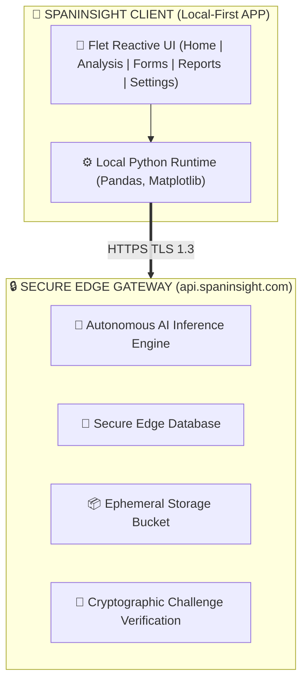

---

## Credit System

| Action                  | Credits     |
| ----------------------- | ----------- |
| AI Suggestion           | 1           |
| Custom Prompt / Voice   | 3           |
| Autopilot (Full Report) | 15          |
| **Daily Allowance**     | **50 FREE** |

---

## Privacy & Security

Spaninsight is designed with a **Privacy-First** philosophy.

1. **Local Execution**: Data processing (filtering, grouping, analysis) happens entirely on your device.
2. **Encryption**: All communication with the AI gateway is encrypted via TLS 1.3.
3. **Data Residency**: We do not store your uploaded CSV/Excel/JSON files. Insights are generated on the fly.
4. **Sandbox Isolation**: AI-generated code runs in a restricted Python environment with no file system or network access.

---

## Legal Disclaimer

Spaninsight is a data analysis tool. While it uses advanced AI to suggest insights, users are responsible for verifying the accuracy of automated reports before making business decisions. Spaninsight does not take responsibility for data loss resulting from local sandbox execution errors.
